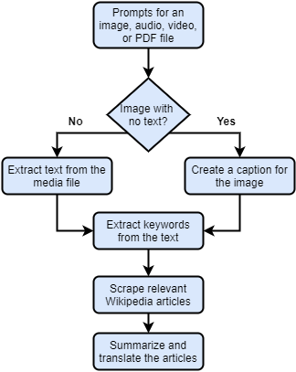

# ClariFile

<!-- [![Contributors][contributors-shield]][contributors-url]
[![Forks][forks-shield]][forks-url]
[![Stargazers][stars-shield]][stars-url]
[![Issues][issues-shield]][issues-url]
[![MIT License][license-shield]][license-url]
[![LinkedIn][linkedin-shield]][] -->


<!-- PROJECT LOGO -->
<p align="center">
  <a href="https://github.com/dgobalak/ClariFile">
    
  </a>

  <h3 align="center">ClariFile</h3>

  <p align="center">
    Built to provide insight into media content.
    <br />
    <a href="https://github.com/dgobalak/ClariFile"><strong>Explore the docs »</strong></a>
    <br>
    <!-- <a href="https://github.com/github_username/repo_name">View Demo</a>
    · -->
    <a href="https://github.com/dgobalak/ClariFile/issues">Report Bug</a>
    ·
    <a href="https://github.com/dgobalak/ClariFile/issues">Request Feature</a>
</p>
</p>


<!-- TABLE OF CONTENTS -->
<summary>
<h2 style="display: inline-block">Table of Contents</h2></summary>

<ol>
<li>
    <a href="#about-the-project">About The Project</a>
    <ul>
	<li><a href="#overview">Overview</a></li>
    <li><a href="#built-with">Built With</a></li>
</ul>
</li>
<li>
    <a href="#getting-started">Getting Started</a>
    <ul>
    <li><a href="#prerequisites">Prerequisites</a></li>
    <li><a href="#installation">Installation</a></li>
    </ul>
</li>
<li><a href="#license">License</a></li>
<li><a href="#contact">Contact</a></li>
<li><a href="#acknowledgements">Acknowledgements</a></li>
</ol>


<!-- ABOUT THE PROJECT -->
## About The Project
<!-- 
[![Product Name Screen Shot][product-screenshot]](https://example.com) -->

### Overview

ClariFile is a tool that takes a media file (.wav, .mp3, .mp4, .pdf, or .png) and provides further information regarding the file's content. We use machine learning, natural language processing, and web-scraping to provide succinct, translated summaries of Wikipedia articles relevant to the file. We've implemented NLP algorithms to extract named entitites and summarize text, so users can quickly learn more about major topics. We use an image captioning ML model to caption images that don't have any text and we use
the textract library for every other file type. All of these features (and more!) are integrated into an easy-to-use Flask website.
<br>
<br>

<p align="center">
   
</p>

### Built With

* Python
* Tensorflow
* NLTK
* Beautiful Soup
* Flask

<!-- GETTING STARTED -->
## Getting Started

To get a local copy up and running, follow these simple steps.

### Prerequisites

* Verify if python (Version >= 3.8) is installed. Previous versions may also work.
  ```sh
  python --version
  ```
  * If not, go to https://www.python.org/downloads.
  <br><br>

* Verify if pip is installed
  ```sh
  pip --version
  ```

### Installation and Setup

1. Clone the repo
   ```sh
   git clone https://github.com/dgobalak/ClariFile.git
   ```
2. Create a virtual environment
   ```sh
   python -m venv venv
   ```
3. Activate the virtual environment
   ```sh
   venv\scripts\activate
   ```
4. Install dependencies
   ```sh
   pip install -r requirements.txt
   ```
5. Start the Flask app
   ```sh
   python run.py
   ```


<!-- USAGE EXAMPLES
## Usage

Use this space to show useful examples of how a project can be used. Additional screenshots, code examples and demos work well in this space. You may also link to more resources.

_For more examples, please refer to the [Documentation](https://example.com)_ -->


<!-- ROADMAP -->
<!-- ## Roadmap

See the [open issues](https://github.com/github_username/repo_name/issues) for a list of proposed features (and known issues). -->


<!-- CONTRIBUTING -->
## Contributing

Contributions are what make the open source community such an amazing place to be learn, inspire, and create. Any contributions you make are **greatly appreciated**.

1. Fork the Project
2. Create your Feature Branch 
```sh
   git checkout -b AmazingFeature
```
3. Commit your Changes 
```sh
   git commit -m 'Add some AmazingFeature'
```
4. Push to the Branch 
```sh
   git push origin AmazingFeature
```
5. Open a Pull Request and wait for it to be reviewed.

## License

Distributed under the Apache 2.0 License . See `LICENSE` for more information.

<!-- CONTACT -->
## Contact

* Daniel Gobalakrishnan - dgobalak@uwaterloo.ca
* Project Link: [https://github.com/dgobalak/ClariFile](https://github.com/dgobalak/ClariFile)


<!-- ACKNOWLEDGEMENTS -->
## Acknowledgements
* <div>Icons made by <a href="https://www.freepik.com" title="Freepik">Freepik</a> from <a href="https://www.flaticon.com/" title="Flaticon">www.flaticon.com</a></div>


<!-- MARKDOWN LINKS & IMAGES -->
<!-- https://www.markdownguide.org/basic-syntax/#reference-style-links -->
[contributors-shield]: https://img.shields.io/github/contributors/github_username/repo.svg?style=for-the-badge
[contributors-url]: https://github.com/github_username/repo_name/graphs/contributors
[forks-shield]: https://img.shields.io/github/forks/github_username/repo.svg?style=for-the-badge
[forks-url]: https://github.com/github_username/repo_name/network/members
[stars-shield]: https://img.shields.io/github/stars/github_username/repo.svg?style=for-the-badge
[stars-url]: https://github.com/github_username/repo_name/stargazers
[issues-shield]: https://img.shields.io/github/issues/github_username/repo.svg?style=for-the-badge
[issues-url]: https://github.com/github_username/repo_name/issues
[license-shield]: https://img.shields.io/github/license/github_username/repo.svg?style=for-the-badge
[license-url]: https://github.com/github_username/repo_name/blob/master/LICENSE.txt
[linkedin-shield]: https://img.shields.io/badge/-LinkedIn-black.svg?style=for-the-badge&logo=linkedin&colorB=555
[linkedin-url]: https://linkedin.com/in/github_username
